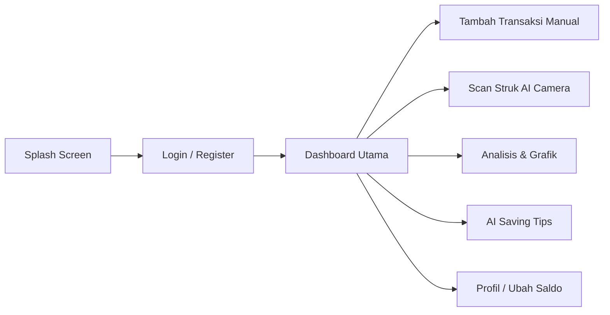
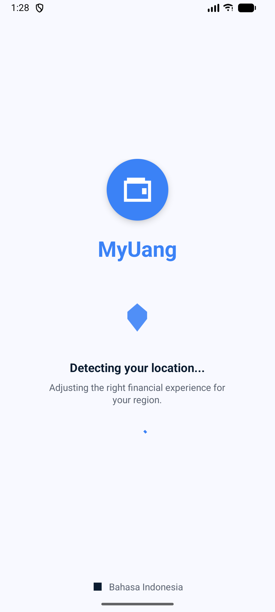
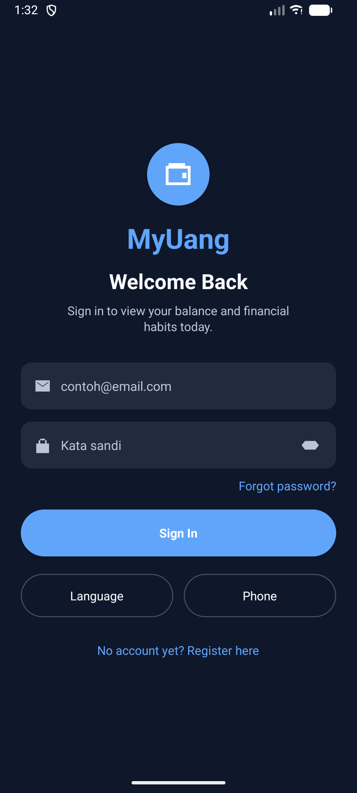
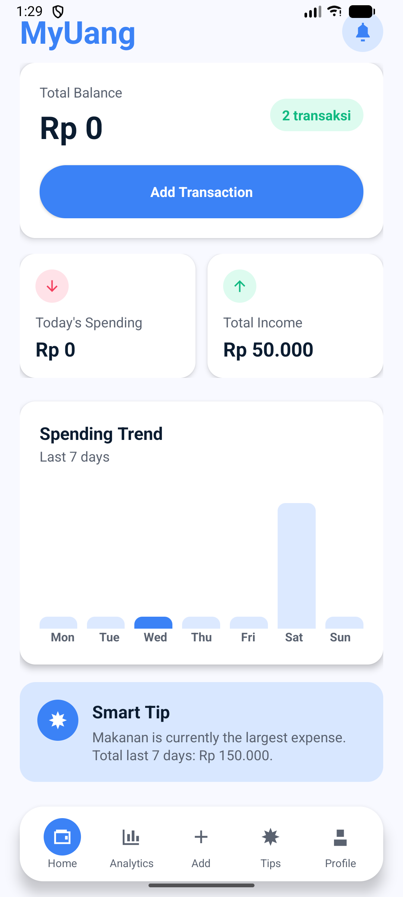
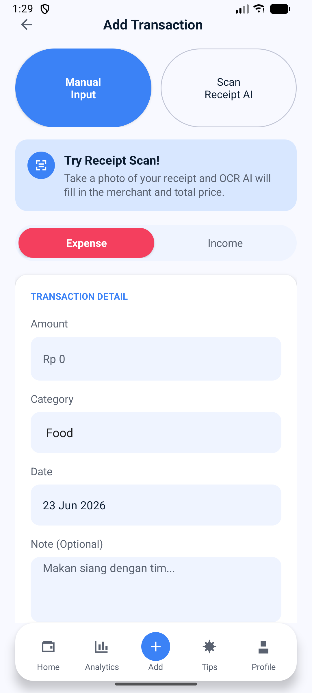
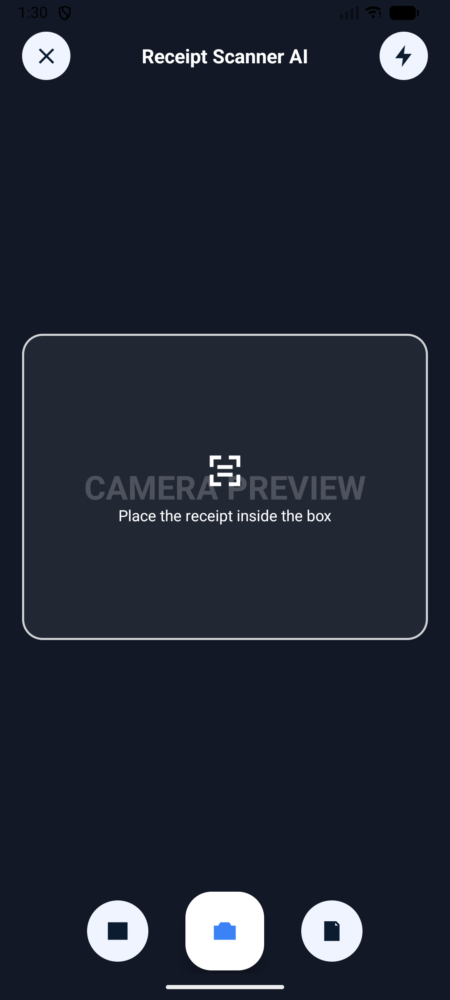
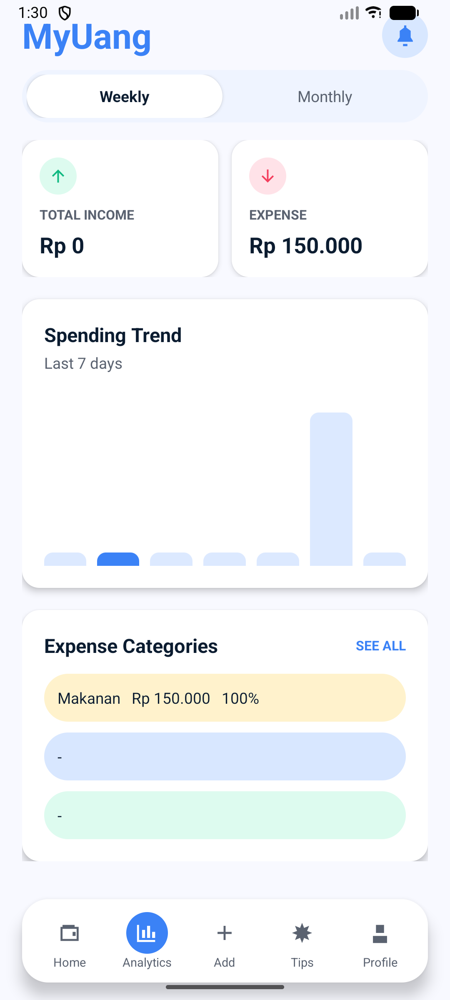
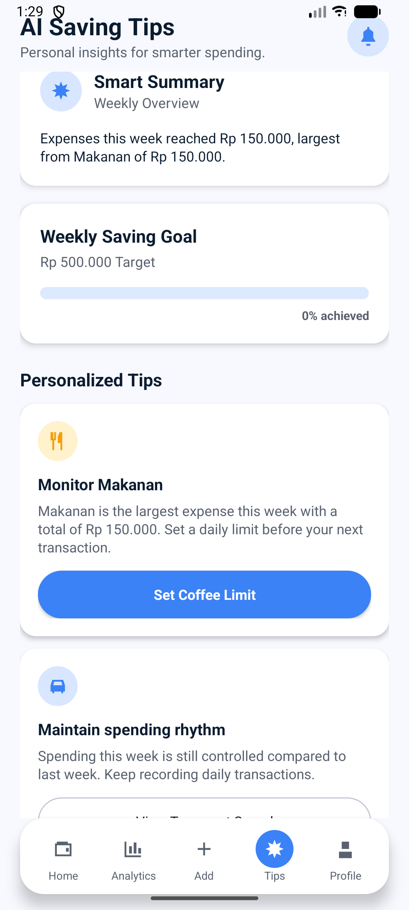
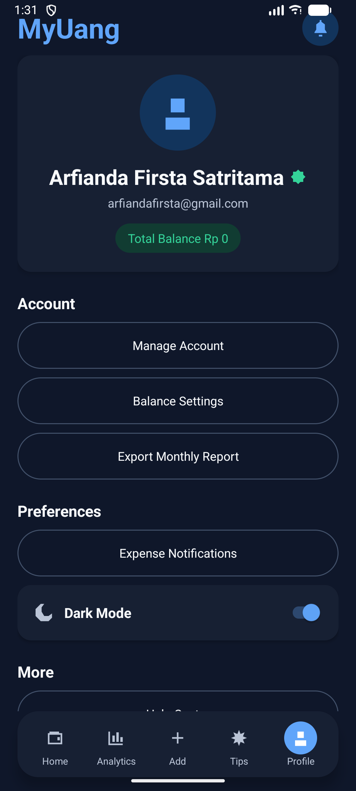

# 📱 MyUang — Smart Finance Tracker Mobile App

**MyUang** adalah aplikasi mobile pencatatan keuangan pintar berbasis **Java (Android Native)** dengan backend **Firebase** dan integrasi **AI**. Aplikasi ini dirancang khusus untuk membantu mahasiswa dan kalangan muda dalam mengelola *cashflow*, mengurangi pengeluaran berlebih, serta memahami kebiasaan finansial mereka secara praktis dan cerdas.

---

## 🚀 Fitur Utama

- 📊 **Financial Dashboard**: Ringkasan sisa saldo, pemasukan, pengeluaran harian, dan pengeluaran terbesar secara real-time.
- 💸 **Smart Expense Tracking**: Catat pemasukan dan pengeluaran secara manual dengan berbagai kategori (Makanan, Transportasi, Hiburan, Belanja, Pendidikan, dll).
- 📷 **AI Receipt Scanner**: Scan struk belanja fisik menggunakan kamera. Berkat teknologi **Google ML Kit OCR**, aplikasi dapat membaca nama toko, tanggal, total harga, dan item secara otomatis.
- 📈 **Expense Analytics**: Visualisasi data pengeluaran dalam bentuk grafik (Pie Chart & Bar Chart) untuk analisis mingguan/bulanan.
- 💡 **AI Saving Tips**: Rekomendasi hemat yang personal berdasarkan kebiasaan transaksi pengeluaran pengguna (misal: analisis pola konsumsi kopi atau transportasi online).
- 🔐 **Secure Auth & Cloud Sync**: Sinkronisasi data aman di cloud secara real-time menggunakan Firebase Authentication & Firestore.

---

## 🛠️ Tech Stack

- **Frontend**: Java (Android Native), XML Layouts
- **Backend**:
  - **Firebase Authentication** (Manajemen Pengguna)
  - **Firebase Firestore** (Database Real-time)
  - **Firebase Storage** (Penyimpanan Struk Belanja)
  - **Firebase Cloud Messaging** (Notifikasi Pengingat)
- **AI/ML Engine**: Google ML Kit OCR & AI Recommendation Engine

---

## 🔄 Alur Kerja Aplikasi (App Flow)

---

## 📱 Rancangan Antarmuka (UI Mockup & Placeholders)

Berikut adalah tata letak antarmuka aplikasi **MyUang** sesuai dengan alur kerja pengguna. Anda dapat mengganti gambar-gambar di bawah ini dengan tangkapan layar (screenshot) asli dari aplikasi Anda dengan menaruhnya di folder `docs/screenshots/`.

### 1. Onboarding & Autentikasi
| Splash Screen | Login / Register |
| :---: | :---: |
|  |  |
| *Deteksi lokasi, bahasa, dan intro singkat.* | *Autentikasi aman via Firebase.* |

### 2. Dashboard Utama & Input
| Dashboard Utama (Real-time) | Tambah Transaksi |
| :---: | :---: |
|  |  |
| *Menampilkan saldo, pengeluaran hari ini, & pintasan cepat.* | *Pencatatan manual berdasarkan kategori.* |

### 3. Pemindaian AI & Analisis Grafik
| AI Receipt Scanner | Analytics Graph |
| :---: | :---: |
|  | 
 |
| *Deteksi struk belanja otomatis via Google ML Kit OCR.* | *Pie/Bar Chart representasi pengeluaran.* |

### 4. Tips AI & Manajemen Akun
| AI Saving Tips | Profil Pengguna |
| :---: | :---: |
|  |  |
| *Rekomendasi hemat personal berbasis kecerdasan buatan.* | *Ubah saldo awal dan pengaturan tema (Dark Mode).* |

> **Catatan**: Beberapa gambar di atas (`dashboard.jpg`, `receipt_scanner.jpg`, `analytics.jpg`, `ai_tips.jpg`) telah kami sertakan sebagai representasi visual awal. Silakan letakkan screenshot nyata Anda di path `docs/screenshots/` untuk memperbaruinya.

---

## ⚙️ Cara Menjalankan Project

1. Buka folder ini di **Android Studio**: `D:\MyUang2.0`
2. Pastikan Android Studio Anda menggunakan **JDK 17+** (atau JDK bawaan Android Studio).
3. Jalankan **Gradle Sync** untuk mengunduh library yang dibutuhkan.
4. Jalankan aplikasi menggunakan emulator atau perangkat fisik (modul `app`).

